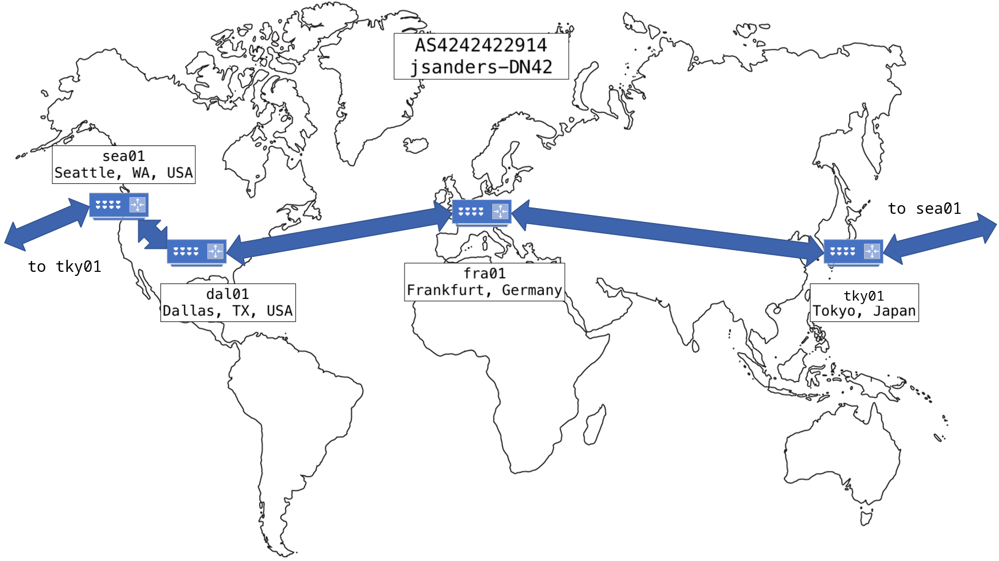

+++
title = 'dn42'
+++

# [dn42](https://wiki.dn42.us/Home)

dn42 is a large decentralized peer-to-peer network intended to simulate the public internet. Participants connect via VPN technologies and then exhange routes via BGP. Participants are registered in an Internet Routing Registry specific to dn42 and are assigned IP space and an ASN. Other common infrastructure includes anycast DNS resolvers for TLD '.dn42' and a Certificate Authority for internally hosted resources.

I run and maintain AS4242422914 in order to give myself some hands-on experience with the bigger picture of setting up and managing an independent ASN and I find this to be a valuable perspective into problems and solutions that I may not have a chance to see from the NOC. Below, I'll detail the architecture and design and some of the decisions that went into it.

## Backbone

