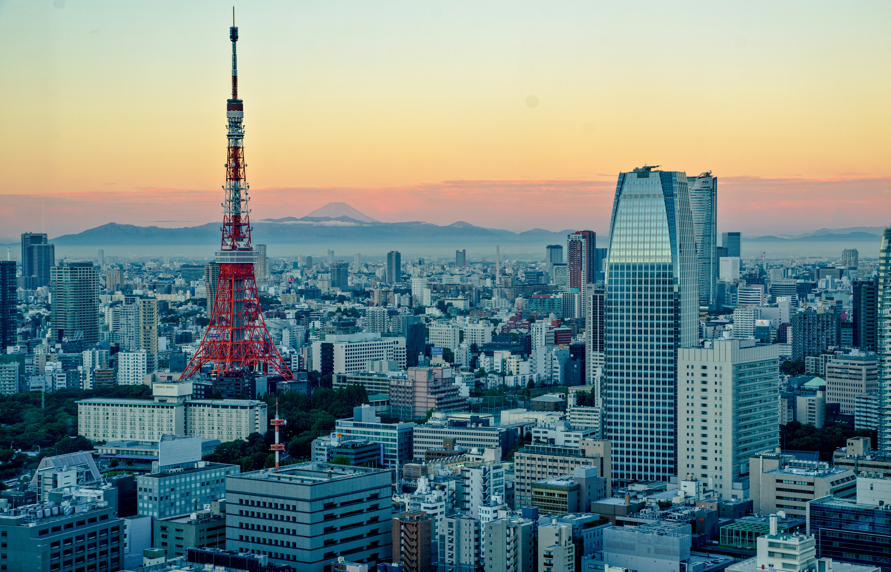

+++
title = 'dn42'
+++

# [dn42](https://wiki.dn42.us/Home)

dn42 is a large decentralized peer-to-peer network intended to simulate the public internet. Participants connect via VPN technologies and then exhange routes via BGP. Participants are registered in an Internet Routing Registry specific to dn42 and are assigned IP space and an ASN. Other common infrastructure includes anycast DNS resolvers for TLD '.dn42' and a Certificate Authority for internally hosted resources.

I run and maintain AS4242422914 (JSANDERS-DN42) in order to give myself some hands-on experience with the bigger picture of setting up and managing an independent ASN and I find this to be a valuable perspective into problems and solutions that I may not have a chance to see from the NOC. Below, I'll detail the architecture and design and some of the decisions that went into it.

## Backbone

In order to have an interesting global topology while keeping hosting costs under control, the AS4242422914 backbone consists of four nodes configured in a ring topology located in Dallas, Seattle, Frankfurt, and Tokyo. 

### dal01 - Dallas, Texas, USA

dal01 was my first dn42 node, chosen as Dallas is a hub for carrier interconnects in the middle of the North America region. Additionally, I lived nearby for a time so it made a convenient access point from my home as well as a peering point for local colleagues. :)

dal01 connects directly to sea01 within the NA region, as well as fra01 in the EU region.

At this time dal01 hosts the public-facing [Looking Glass](https://lg.dn42.jennsanders.net/) page as well as the internal RPKI-RTR feed, however a move to sea01 is planned for these services.

### sea01 - Seattle, Washington, USA

sea01's location was also chosen for perhaps personal reasons, but also as a popular regional interconnection hub and trans-Pacific cable landing point.

sea01 connects directly to dal01 within the NA region and also has a trans-Pacific connection to tky01 in Asia.

sea01 hosts the 'brains' of the network with services including monitoring (Cacti, LibreNMS, Oxidized), DNS, IPAM/inventory (NetBox), and automation (Ansible) with more services planned to be migrated there in the future.

### tky01 - Tokyo, Japan

Tokyo was chosen for my third node tky01 as it is a common landing station for trans-Pacific cables, especially from Seattle. Additionally, proximity to colleagues in Japan for peering was another contributing factor.

tky01 is a geographically isolated node, but maintains interregional connections to Seattle in NA and Frankfurt in EU.

### fra01 - Frankfurt, Hesse, Germany

Frankfurt node fra01 rounds out our portfolio, providing a presence in the EU region. A node in Germany was seen as ideal due to the large number of dn42 participants in the country and Frankfurt is ideal as Germany's largest interconnection hub.

fra01 is another isolated node but maintains connections to dal01 and tky01.

### Other potential locations

While I try to keep the number of nodes down to minimize hosting costs, I do keep a shortlist of possible future node locations.

- New York City, USA
    - was formerly a node between dal01 and fra01 but shut down to minimize cost
    - may be resurrected for an east coast presence w/ a full mesh in NA, moving the trans-Atlantic connection from dal01
- Singapore
    - connection hub of south east Asia with proximity to Australia and India which enables peering in Asia that is too far for tky01
    - I have been there and really enjoyed it :)
- Sao Paolo, Brazil
    - provides a South American presence
- Cape Town, South Africa
    - provides an African presence
